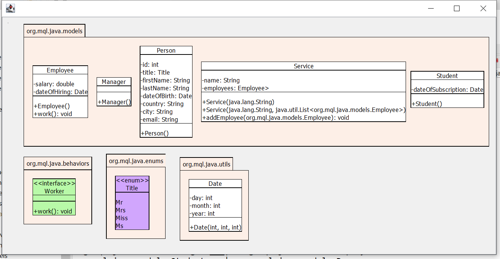

# UML Diagrams Generator

Une application qui permet d’extraire l’ensemble des classes et packages d’un projet Java. L’objectif final étant de construire comme sortie :

- Un diagramme de packages et donc l’architecture globale du projet
- Les diagrammes de classes UML correspondants.

# Important

- Passez un paramètre du chemin du dossier bin ou du dossier qui contient les fichiers (.class)

- Les fichers XML sont générés dans le dossier bin.

# Résultat d'éxecution

## L'interface graphique

Dans l'exemple suivant le diagramme de packages d'un système de gestion d'une école :



## Résultat du parsing de l'ensemble des entités et leurs relations

```text
----------------------------------
Project : School management system
----------------------------------

List of packages
----------------

Package : org.mql.java.behaviors
	Interface : Worker
	 	+ work() : void


Package : org.mql.java.enums
	Enumeration : Title
	 	Mr
	 	Mrs
	 	Miss
	 	Ms


Package : org.mql.java.models
	Class : Employee
	 	- salary : double
	 	- dateOfHiring : Date
	 	+ Employee()
	 	+ work() : void

	Class : Manager
	 	+ Manager()

	Class : Person
	 	- id : int
	 	- title : Title
	 	- firstName : String
	 	- lastName : String
	 	- dateOfBirth : Date
	 	- country : String
	 	- city : String
	 	- email : String
	 	+ Person()

	Class : Service
	 	- name : String
	 	- employees : Employee>
	 	+ Service(java.lang.String)
	 	+ Service(java.lang.String, java.util.List<org.mql.java.models.Employee>)
	 	+ addEmployee(org.mql.java.models.Employee) : void

	Class : Student
	 	- dateOfSubscription : Date
	 	+ Student()


Package : org.mql.java.utils
	Class : Date
	 	- day : int
	 	- month : int
	 	- year : int
	 	+ Date(int, int, int)


List of relations
-----------------

org.mql.java.models.Employee ---|> org.mql.java.behaviors.Worker
org.mql.java.models.Employee ___|> org.mql.java.models.Person
org.mql.java.models.Employee ---<> org.mql.java.models.Service
org.mql.java.models.Manager ___|> org.mql.java.models.Employee
org.mql.java.models.Student ___|> org.mql.java.models.Person
org.mql.java.utils.Date _____ org.mql.java.models.Employee
org.mql.java.utils.Date _____ org.mql.java.models.Person
org.mql.java.utils.Date _____ org.mql.java.models.Student

```